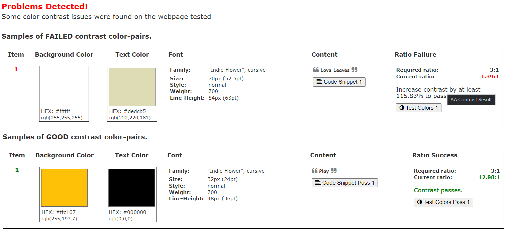
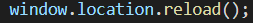

# Portfolio Project 2 - HTML / CSS / JavaScript
## Love Leaves - Live Game Application
[View Live Site](https://laurajones929.github.io/portfolio-p2/)

## Business Objectives
I have created an online game that is targeted towards children of primary education ages (5-11 yrs). After working in a primary school for the past 8 years I have a good idea of the curriculum and what apps and games come in useful for children's learning. I have seen children use apps and online games to advance their learning in every subject. One lesson that stood out for me over the years was a Science lesson where the children would have to identify the leaves from different trees. They would go out with a clipboard, and work sheet with various pictures of leaves on and they would have to find that type of tree in the school garden.
The game I have created would allow the children to take their learning further and implement that knowledge.

I have chosen to use a mobile first approach as children have better access mobile devices and tablets rather than desktops.
The webpage is also easier to navigate on a mobile design as the children don't have to think using a mouse or keyboard to play.

## Mockup

# User Experience (UX)
## User Stories
### **First Time Visitor Goals**
- "As a first time visitor, I want to know what the game is about when first landing on the page, for my child to use."
- "As a first time visitor, I want my child to be able to access the game quickly through the click of a single button."
- "As a first time visitor, I want to test my knowledge of various trees."

### **Returning Visitor Goals**
- "As a returning visitor, I want to attempt to beat my previous score."
- "As a returning visitor, I want my child to continue to improve their knowledge on different trees."

### **Frequent Visitor Goals**
- "As a frequent visitor, I like to try to beat my previous scores."

## Design

### **Colour Scheme**
The main colours for this project are tones of green and cream, to match the theme of the application (nature/trees/leaves). The elements consisting mainly of: **#dedcb5** and **rgb(54,112,45, 0.6)**. I wanted the colours to be bright and eye-catching to hold the users' attention, baring in  mind that the target audience is children of a primary education age, the colours should be bright, bold and fun.

I used the [Coolors Contrast Checker](https://coolors.co/contrast-checker/112a46-acc8e5) to test these colours. I chose to go ahead and continue to use these colours as the result was 'good' when using large text. Also the shadow effect on the text makes it stand out a lot more against the green.

- The background image is an image of a green hedge with yellow tones coming through as well as darker shadow tones, so finding the right colour for the foreground elements was important so that it didn't clash with the background image.
- The 'Love Leaves' heading uses **#dedcb5** with a text shadow of **5px**.
- The question container uses a background colour of **rgb(54,112,45, 0.6)** and a text colour of **#dedcb5**.
- Button elements use the **#dedcb5** to tie in with the question text.
- The score container uses **rgb(54,112,45, 0.6)** and the text inside uses **#dedcb5**, again with a text shadow (black).
- The 'Play' and 'Play Again' buttons use Bootstrap's 'btn-warning' class (yellow), with the text using 'black'.
- The results container uses the same theme of the green background **rgb(54,112,45, 0.6)** and **#dedcb5** text.

### **Typography**
Fonts are imported into the CSS file via Google Fonts.

The font styles that I have chosen have a fun yet simple characteristic feel to them, so the user can easily read the text if they are of a younger age.
- 'Indie Flower'
- 'Dongle'

The main heading/title and the control buttons use the 'Indie Flower' as I think the first impression when entering the webpage should have a fun, welcoming feel to it.

Other text such as the question, answer buttons and results use 'Dongle'. This font is easier to read as it is more simplistic but still has an element of childishness to it.

### **Imagery**
- Background image - [Pixabay](https://pixabay.com/)
- All question images are sourced from [Pixabay](https://pixabay.com/)

## Wireframes

Below are 3 links to show the initial drafts for each screen size. They show how I expect the responsivity between devices to go and how the structure of each page will look.

The project is designed with a mobile first approach. I felt this was more appropriate as the game is aimed at children for educational purposes.

[Tablet Wireframe](wireframes/tablet.md)

[Mobile Wireframe](wireframes/mobile.md)

[Desktop Wireframe](wireframes/desktop.md)

Changes made after creating initial drafts (wireframes) :

- I decided to put a score container at the bottom of the page that increments the score after each correct answer. I think this would create a better user experience by giving immediate, visual feedback to the user when they are playing.

- When all questions have been answered, a results container appears giving the user their total score.

- Under the results container is a 'Play Again' button which gives the user the opportunity to play again. Clicking this button resets the game and reloads the first question.

- I have not included the alerts after a question is answered, as it felt like an unnecessary extra button click before moving onto the next question.

- I had wanted to include a clickable link on the alert that gave the user more information about that tree, by using a Wikipedia API. However after researching how to do this, I felt as though it was a little out of my depth. This could maybe be something I can implement in further projects in the future when I am more confident with API's.

## Various Mockups

## Features

### **Existing Features**

### **Features yet to implement**

## Languages & Technologies Used
- HTML - Used to build the main structure of the webpage.
- CSS - Used to style the content of the webpage.
- JavaScript - Used to make the webpage/game interactive for the user.
- Google Fonts - Imbedded in the CSS, Google fonts are used throughout the body of the text.
- Balsamiq - Used to create wireframes for the project.
- Chrome Dev Tools - Used to oversee the development of the website and debugging.
- Github - To store repositories and codes after being pushed on Gitpod.
- Git - Used for version control and tracking changes made to files.
- Gitpod - Used for the workspace for this project.
- Multi Device Mockup Generator (techsini) - To create an image of what the project will look like on various devices. TechSini.com
- Coolors Contrast Checker - To test colours throughout the site for whether or not they will produce good user experience.
- W3C Markup Validator - To check for any HTML or CSS errors.
- JShint Validator - To check for any errors in my JavaScript code.

# Testing

Most testing was carried out via Google Chrome browser and Chrome Dev Tools for responsivity and checking to see if the JavaScript code was working as expected, throughout the process of building the project. I also tested the site on an iPhone 12 for responsivity, this included Google Chrome and Safari browsers.

## Manual Testing

Manual testing was carried out once the main features of the game had been implemented onto the webpage. After deploying the page early on in the project, I was able to use my iPhone to do manual testing across Google Chrome for iOS and Safari, as well as constant testing on desktop via Chrome Dev Tools.

Upon the first test I noticed that the background image was not showing on either mobile browsers, however the image was showing on the desktop.
Also, on Google chrome the buttons (game.html) css styling was not being applied, but was on Safari.

- Landing Page
    - The background image is visible and centered to create the desired "nature" look.
    - 'Play' button sits underneath the game title as takes user to the game page when clicked.

- Game Page
    - The first question is shown when the page loads.

- Question Images
    - The image changes when the user gets an answer right, ready for the next question.

- Answer Buttons
    - When a button is clicked correctly, it turns green and the user is directed to the next question, with a new image and new arrangement of answers.
    - When a button is clicked incorrectly, it turns red and the user is given further chances until answered correctly. (As this game is intended for young children, I wanted to keep answering the questions as simple as possible for learning purposes.)

## Additional Testing
I used the [a11y Contrast Checker](https://color.a11y.com/Contrast/) to test all colours throughout the project.

As you can see there is a problem detected with the #DEDCB5 against the white on the 'Love Leaves' heading. I am happy to leave these colours as they are, as the shadow styling around the text makes it a lot more visible. I can confidently say that the heading is easily read-able.

I used the [W3C Markup Validation](https://validator.w3.org/) and the [W3C CSS Validator](https://jigsaw.w3.org/css-validator/) to ensure that there were no syntax errors throughout the project.

W3C Markup Results(screenshot)
W3C CSS Results(screenshot)

## User Story Testing

User Story Testing(link)

### Known Bugs and Fixes
- When iterating through the array for each question, the image would not change along with the options (answers). This was resolved with support from my tutor by adding the following code:

This line of code was added to each button event listener and ran whenever a question was answered correctly. *HTML lines 135, 149, 163, 176.*

- The above bug fix then created another issue. On each reload the score that was supposed to be incremented with each correct answer, was reverting back to 0.

# Deployment

This project was created using Gitpod, which enabled me to stage and commit the files via Git (version control) and pushed into the respository on Github.

## To deploy the project on Github:
- Select the repository you wish to deploy.
- Click the Settings tab within that repository.
- In the Settings, scroll down and select Pages.
- In the Source section, click Branch and select the main option, click Save.
- The URL for the deployed project is now saved in Pages.

## Forking the Github Repository:
Choose to fork the repository by making a copy. You can then make changes to the copy without it affecting the original repository.

- Select the repository you wish to fork.
- In the top right corner of the page (under your account icon) there will be an option to Fork.
- By selecting Fork you will now have a copy of the respository in your own Github account.

## Cloning the Github Repository:
- Select the repository you wish to clone locally.
- Above the files, locate the Code dropdown menu.
- Select and copy the link appropriately (HTTPS, SSH, Github CLI).
- Open the terminal and change the directory to where you want the cloned version to be located.
- Type git clone and paste the copied link.
- Press Enter to create local clone.

# Credits

## Code
- Stackoverflow Forums

- Mentor - Felipe Souza Alarcon

## Media
- Pixabay
    - Providing free stock images to use in my webpage (background image and images used in the questions)

## Acknowledgements
- Tutors at Code Institute
- Slack Community Members

# Personal Development
